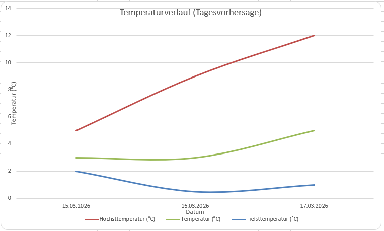
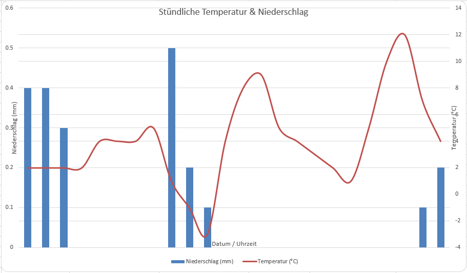

# PythonWeather — Technische Dokumentation

## 1. Programmbeschreibung

### Thema

PythonWeather ist eine Kommandozeilen-Anwendung zur Abfrage und Aufbereitung von Wetterdaten. Die Daten werden über die wttr.in-API bezogen und als formatierte Excel-Dateien mit Diagrammen exportiert.

### Ziel

Das Programm ermöglicht es, für eine oder mehrere Städte aktuelle Wetterdaten sowie Vorhersagen abzurufen und übersichtlich in Excel-Dateien darzustellen — inklusive Diagrammen und bedingter Formatierung.

### Hauptfunktionen

- **Wetterdaten abrufen**: Asynchrone Abfrage von Wetterdaten für beliebig viele Städte
- **Datenverarbeitung**: Aufbereitung der Rohdaten in strukturierte Dictionaries (aktuelles Wetter, Tagesvorhersage, stündliche Vorhersage)
- **Excel-Export**: Erstellung formatierter Excel-Dateien mit zwei Tabellenblättern, Diagrammen, bedingter Formatierung und automatischer Spaltenbreite

---

## 2. Beschreibung des Aufbaus

### Projektstruktur

```
PythonWeather/
├── main.py                  # Einstiegspunkt
├── requirements.txt         # Abhängigkeiten
├── src/
│   ├── weather_fetcher.py   # Wetterdaten-Abfrage
│   ├── data_processor.py    # Datenverarbeitung
│   └── excel_exporter.py    # Excel-Export
├── doc/                     # Dokumentation und Diagramme
└── out/                     # Generierte Excel-Dateien
```

### Klassen und ihre Aufgaben

| Klasse | Datei | Aufgabe |
|--------|-------|---------|
| `WeatherDataFetcher` | `src/weather_fetcher.py` | Asynchrone Abfrage der Wetterdaten über die python_weather-Bibliothek (wttr.in) |
| `WeatherFetchError` | `src/weather_fetcher.py` | Eigene Exception-Klasse für Fehler beim Datenabruf |
| `DataProcessor` | `src/data_processor.py` | Transformation der Rohdaten in formatierte Dictionaries für den Excel-Export |
| `ExcelExporter` | `src/excel_exporter.py` | Erstellung formatierter Excel-Dateien mit Tabellen, Diagrammen und Styling |

### Wichtige Methoden

**WeatherDataFetcher:**
- `async fetch(city)` — Ruft Wetterdaten für eine einzelne Stadt ab
- `async fetch_multiple(cities)` — Ruft Wetterdaten für mehrere Städte sequenziell ab, mit Fehlerbehandlung pro Stadt

**DataProcessor:**
- `process_current_weather(forecast)` — Extrahiert aktuelle Wetterbedingungen (Temperatur, Luftfeuchtigkeit, Wind, etc.)
- `process_daily_forecasts(forecast)` — Erstellt Tagesvorhersagen (Höchst-/Tiefsttemperatur, Sonnenstunden, Mondphase, etc.)
- `process_hourly_forecasts(forecast)` — Erstellt stündliche Vorhersagen (Temperatur, Niederschlag, Bewölkung, etc.)

**ExcelExporter:**
- `export(city, current_data, daily_data, hourly_data)` — Hauptmethode: erstellt die komplette Excel-Datei und gibt den Dateipfad zurück
- `_create_current_weather_sheet()` — Erstellt das Tabellenblatt "Aktuelles Wetter"
- `_create_forecast_sheet()` — Erstellt das Tabellenblatt "Vorhersage" mit Tages- und Stundentabellen
- `_add_temperature_chart()` — Fügt ein Liniendiagramm mit Temperaturverlauf hinzu
- `_add_hourly_temp_precip_chart()` — Fügt ein Kombi-Diagramm (Balken + Linie) für Temperatur und Niederschlag hinzu

### Ablauf der Datenverarbeitung

```
Kommandozeile (Städtenamen)
        │
        ▼
WeatherDataFetcher.fetch_multiple()
        │  Abruf via python_weather (wttr.in API)
        ▼
dict[str, Forecast]  (Rohdaten pro Stadt)
        │
        ├─► DataProcessor.process_current_weather()  → dict
        ├─► DataProcessor.process_daily_forecasts()   → list[dict]
        └─► DataProcessor.process_hourly_forecasts()  → list[dict]
                │
                ▼
        ExcelExporter.export()
                │  Erstellt Workbook mit 2 Sheets + Diagrammen
                ▼
        out/Wetter_{Stadt}_{Zeitstempel}.xlsx
```

---

## 3. UML-Klassendiagramm

Das Klassendiagramm zeigt die vier Klassen des Projekts mit ihren Attributen, Methoden und Beziehungen. Das `main`-Modul orchestriert den Ablauf und nutzt alle drei Klassen. Externe Abhängigkeiten (`python_weather`, `openpyxl`) sind als gestrichelte Boxen dargestellt.


---

## 4. UML-Sequenzdiagramm

Das Sequenzdiagramm zeigt den Ablauf eines typischen Programmstarts:

1. Der Benutzer startet das Programm mit Städtenamen als Argumente
2. `main` erstellt die drei Objekte und ruft `fetch_multiple()` auf
3. `WeatherDataFetcher` fragt die wttr.in-API ab und gibt `Forecast`-Objekte zurück
4. `DataProcessor` verarbeitet die Rohdaten in drei Schritten (aktuell, täglich, stündlich)
5. `ExcelExporter` erstellt die formatierte Excel-Datei mit Tabellen und Diagrammen


---

## Beispiel-Diagramme aus dem Excel-Export

### Temperaturverlauf (Tagesvorhersage)



### Stündliche Temperatur & Niederschlag



---

## Installation und Verwendung

### Installation

```bash
pip install -r requirements.txt
```

### Verwendung

```bash
python main.py <Stadt1> [Stadt2] [Stadt3] ...
```

**Beispiele:**

```bash
python main.py Basel
python main.py Basel Bern Zürich
```

Die Excel-Dateien werden im Verzeichnis `./out/` gespeichert.

### Abhängigkeiten

- `python-weather` — Wetterdaten via wttr.in
- `openpyxl` — Excel-Erstellung und Diagramme


## Bekannte Fehler

### Diagramme
Die Darstellung von Diagrammen kann je nach verwendetem Tabellenkalkulationssoftware und Betriebssystem variieren. In manchen Fällen wird die Legende aufgrund technischer Restriktionen von nicht korrekt gerendert.